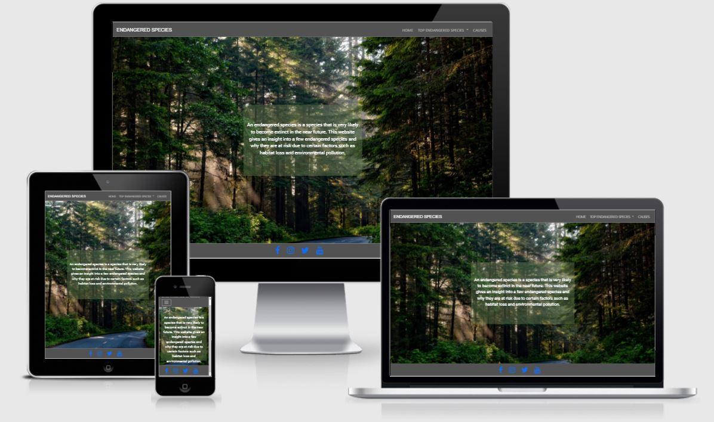
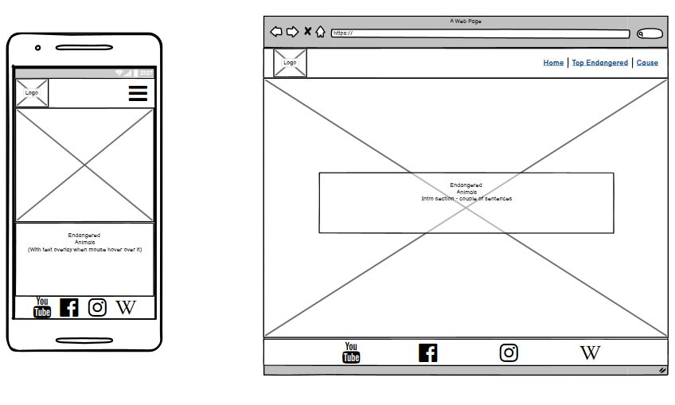
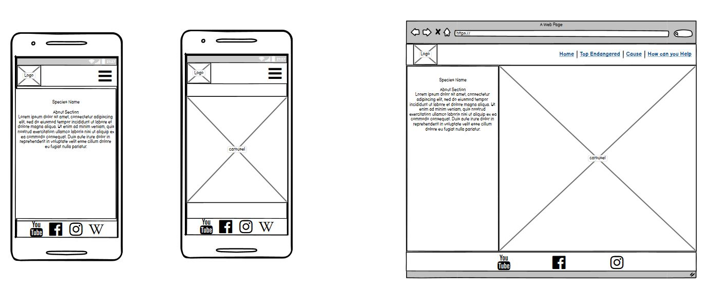
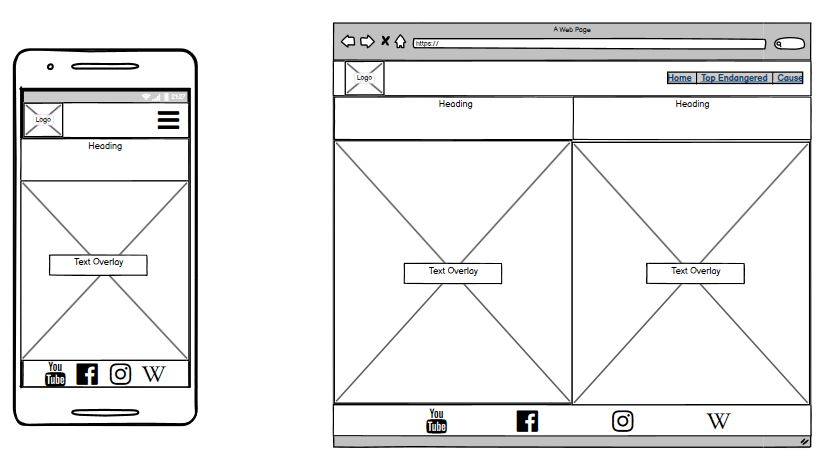
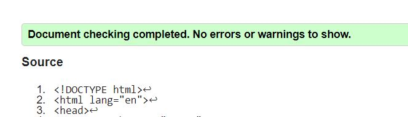
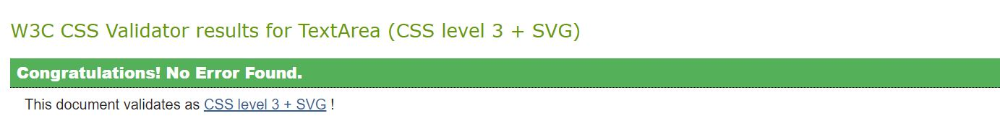
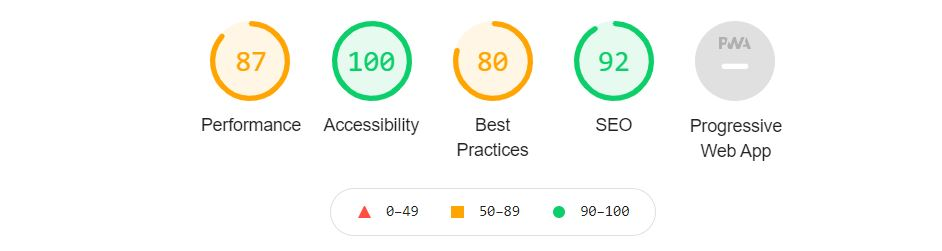

# [TOP ENDANGERED SPECIES](https://dhruv2102.github.io/MS1/)

## Content

- [Introduction](#introduction)
- [WireFrames](#wireframes)
- [User Stories](#User-Stories)
- [Technologies Used](#Technologies-used)
- [Testing](#testing)
- [Known Issues](#Known-issues)
- [Deployment](#Deployment)
- [Running Project Locally](#running-project-locally)

## Introduction

The purpose of this website is to make users aware of the endangered species 
around the world and the root causes of it. 

## WireFrames

We used Balsamiq to generate wirefrae a rough layout of the images
1. Home page
    - 

2. Top-Endagered Species pages
    - 

3. Causes page
    - 

## User Stories

As a user, I would like to 
1. Navigate through the website easily.
2. Learn more about each endangered species listed.
3. Learn what is causing the species to get endangered
4. Have social links for relevant acoounts added
5. Have strong accessibility
6. Use the website on mobile/laptop without 

## Technologies Used

- [HTML](https://en.wikipedia.org/wiki/HTML5)
    - HTML was to give structure to page and content

- [CSS](https://en.wikipedia.org/wiki/CSS)
    - CSS was used to style the content

- [Bootstrap 4.5](https://getbootstrap.com/docs/4.5/getting-started/introduction/)
    - This helped made content responsive 

- [Git](https://git-scm.com/)
    - Git was used for version control, which helped in keeping track of changed files

- [GitHub](https://github.com/)
    - Github was used to store and deploy the project

- [Gitpod](https://www.gitpod.io/)
    - Gitpod was used to write code in. It is a cloud based platform

- [Google fonts](https://fonts.google.com/)
    - Google fonts was used to import different fonts from google

- [Font Awesome](https://fontawesome.com/)
    - This was used to get the icons for social media 

- [Balsamiq](https://balsamiq.com/wireframes/)
    - Balsmiq was used to design the basic structure of the website

- [Stack Overflow](https://stackoverflow.com/)
    - Stack overflow was used debug code

- [W3schools](https://www.w3schools.com/)
    - This was used to understand concept of flexbox and get overlay code

- [Code Institute learning platform](https://codeinstitute.net/)
    - With the help of code institute I was able to understand how a static website is made

- [Pixabay](https://pixabay.com/)
    - This was used to get all the images used in this project. 

- [Jigsaw](https://jigsaw.w3.org/css-validator/validator)
    - Tool for CSS validation

- [W3C validator](https://validator.w3.org/)
    - Tool for HTML validation

- [Lighthouse](https://developers.google.com/web/tools/lighthouse)
    - Tool for performance, accessiblity analysis

- [Am I Responsive](http://ami.responsivedesign.is/)
    - Tool used to check how website will look across different screen size

    
## Testing
During the developement of website, google chrome developer tools were used to test eh website 
and check the responsiveness of the code implemented. The final testing was done on
- Asus UX410 laptop, 14" screen, 1920x1080p resolution
    - Firefix
    - Google chrome
    - Microsoft Edge

- Oneplus 6T, 6.41" screen, 1080p (2340×1080 pixels)
    - Google chrome

The testing scenarios and results were as follows

1. Testing whether pages loading correctly
    - To test this all the pages were opened on all web browser
    - Result: All the pages loaded correctly

2. Testing intenal links
    - Tested all the internal links by opening them on all pages
    - Result: ALl the internal links were working properly

3. Clicking on Logo brings back to home screen
    - Result: WHen the logo is clicked on, it brings back to the home screen

4. W3C Validator results
    - All html files were run through the w3c validator and got the same results
    - 

5. Jigsaw Validator results
    - The results for jigsaw validator were as follows
    - 

6. Lighthouse accessibility results
    - The results for red_panda.html were as follows
    - 

## Known Issues

1. The Caraousel Images don't transition smoothly
    - Possible Fix: The possible fix for this is using javascript

2. Low Lighthouse Best Practices Results
    - This is caused due to first 2 images in carousel aren't being loaded by the browser
    - This images are loaded perfectly when the project is run locally. 
    - Fix: 
        - The issue was that file path for the first 2 pictures had a leading slash. Since github pages is case sensitive and needs the relative path
        the leading `/` caused an issue.

## Deployment
I used github pages to deploy the website. To deploy a project, one should follow the following steps
1. Log into github and locate the repository.
2. Find the settings tab and click on it
3. Locate the GitHub pages section
4. In the source sub-section, select the master branch from dropdown
5. Click on save, and you'll find your live link there

The link to my project is: https://dhruv2102.github.io/MS1/

## Running Project Locally
To run the project locally, follow these steps
1. Open the repository https://github.com/dhruv2102/MS1
2. Choose HTTPS clone opeion from the code button.
3. Copy this command
4. Open the directory where you want to clone the project to. 
5. Open the Git Bash terminal in the taegeted directory.
6. Type the command git clone and then past the HTTPS url
6. After the execution of the command, this repository would be created in the directory. 

## Credits

### Media
    - The media was used from [Pixabay](https://pixabay.com/) and seahorse picture by [Justin Hoffman](https://www.theverge.com/2017/9/15/16314928/justin-hofman-seahorse-plastic-pollution-photography)

### Acknowledgement
    - I would like to than my Mentor for guiding me through the project.
    - I would like to thank Alexander from Student Care Team for helping me get a deferral. 